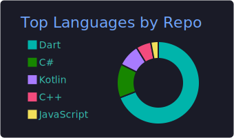
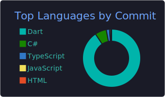

<h3>🚀 Designing Systems. Leading Teams. Shipping Value.</h3>

Experienced technology leader focused on building scalable <b>Fintech Infrastructures</b> and high-performance <b>Mobile Ecosystems</b>.

Recently exited a <b>CTO</b> role at a fintech startup after successfully architecting the core banking infrastructure.

Currently open to architecting the next big thing.

📍 <b>Istanbul, Turkiye</b> 🇹🇷 | 🗣️ <b>Turkish, English, Spanish</b>

 

<h3 align="center">🏆 Career Highlights & Architecture Philosophy</h3>

<b>Strategic Leadership • Technical Excellence</b>

🛡️
Ex-CTO Experience: Led technological vision, roadmap, and cross-functional teams for a Fintech startup (Bishy Payment).

🏗️
Monorepo Design: Segregating complex projects into UI, Core, and Business Logic packages for maximum reusability.

🚀
Zero-to-One: Built resilient, cloud-native fintech architectures from scratch with high availability focus.

⚡
Performance Engineering: Leveraging Rust bridging and MethodChannels for native-level performance in Flutter.

 

<h3 align="center">🛠️ Technical Arsenal</h3>

<table align="center">
<tr>
<td align="center" width="33%">

 
<b>Mobile & Core</b>
</td>
<td align="center" width="33%">

 
<b>Backend & Systems</b>
</td>
<td align="center" width="33%">

 
<b>Architecture & DevOps</b>
</td>
</tr>
<tr>
<td valign="top" align="center">

</td>
<td valign="top" align="center">

</td>
<td valign="top" align="center">

</td>
</tr>
</table>

 

<h3>📊 GitHub Analytics</h3>

 

 

 
<i>"Architecture is about making important decisions that are hard to change later."</i>

